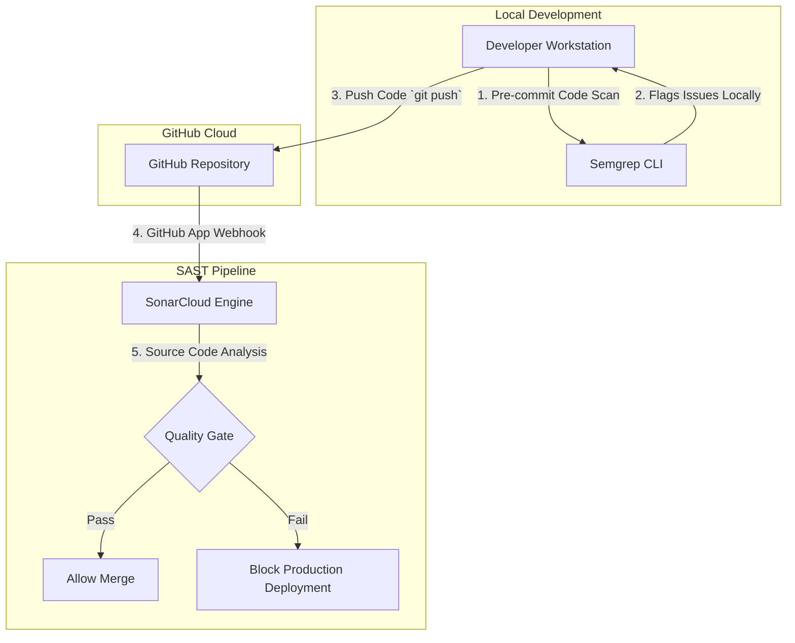

# Lab 04: Real-time Code Quality and SAST

## Aim
To implement Static Application Security Testing (SAST) to automatically analyze source code for bugs and security vulnerabilities on every commit using cloud-based tools and local pre-commit scanners.

---

## Architecture Diagram



---

## Tools Required
* **GitHub Account:** To host the source code and trigger webhooks.
* **SonarCloud:** Cloud-based SAST platform (Free/Open-Source tier).
* **Semgrep (CLI):** Fast, open-source static analysis engine for finding bugs and enforcing code standards at the terminal level.

---

## Execution Steps

### 1. SonarCloud Pipeline Integration
1. Log in to [SonarCloud](https://sonarcloud.io) using your GitHub account credentials.
2. Select **+ Analyze new project** and import your vulnerable target repository.
3. Push a new commit to the repository's main branch:
   ```bash
   git commit -am "trigger sonar scan"
   git push origin main
   ```
4. Access the SonarCloud dashboard and review the **Security Hotspots**, noting the OWASP Top 10 categorizations (e.g., A03:2021 – Injection).

### 2. Local Scanning via Semgrep
1. Install Semgrep locally via Python package manager:
   ```bash
   pip install semgrep --break-system-packages
   ```
2. Navigate to your project directory and run the automated ruleset against your source code:
   ```bash
   semgrep --config=auto ./src
   ```
3. Review the CLI output to identify blocking vulnerabilities (e.g., cross-site scripting sinks) before code is pushed to version control.

---

## Screenshots

### 1. SonarCloud Quality Gate Failure
*(Student: Insert your SonarCloud dashboard screenshot here showing the Security Hotspots and failed Quality Gate)*

### 2. Semgrep CLI Vulnerability Detection
*(Student: Insert your terminal screenshot here showing Semgrep catching the XSS vulnerability in the local code)*

---

## Result
* Successfully integrated a continuous SAST pipeline using SonarCloud, mapped findings to OWASP standards, and enforced a Quality Gate.
* Successfully configured Semgrep for rapid, offline code scanning to shift security testing to the earliest phases of the developer workflow.
